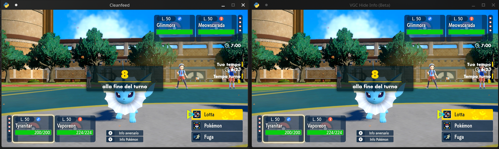
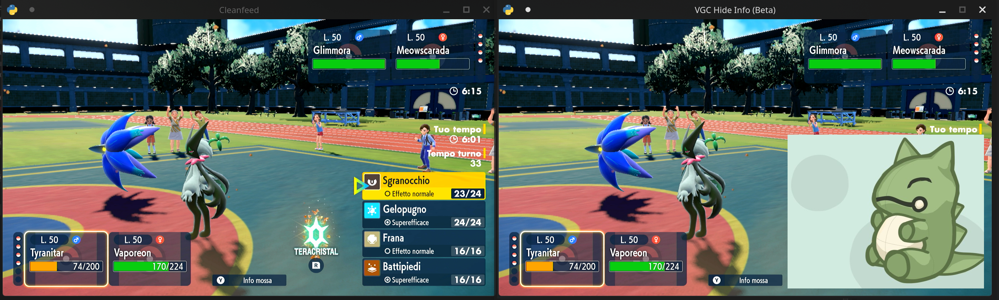

# VGC Live Covert Cloak

Source code for VGC Live Covert Cloak: a simple tool to hide VGC info while live streaming matches.

Using this tool you won't need to set a delay on your stream to avoid sniping from opponents.

The tool scans for the game HUD

and covers informations that your opponents may use to take advantage on you

 
 

NOTE: This is currently a work in progress, please be patient.